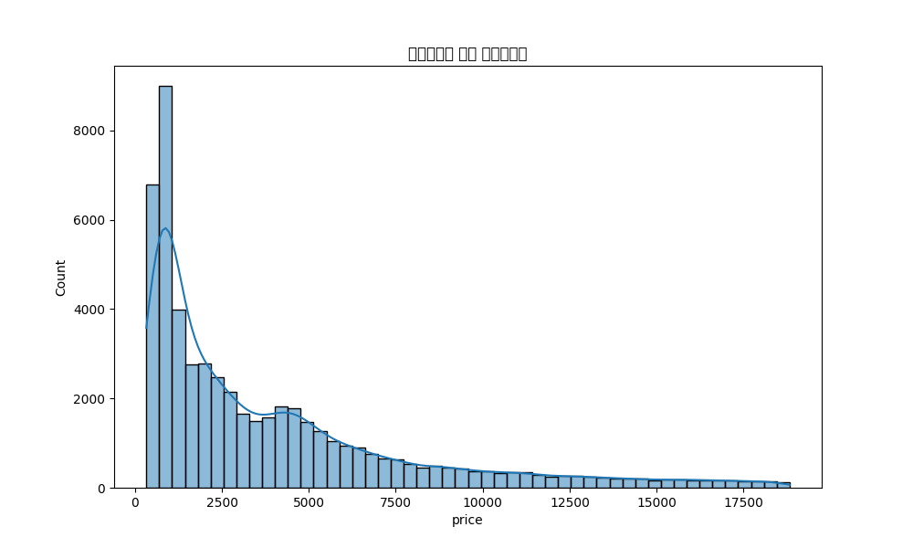
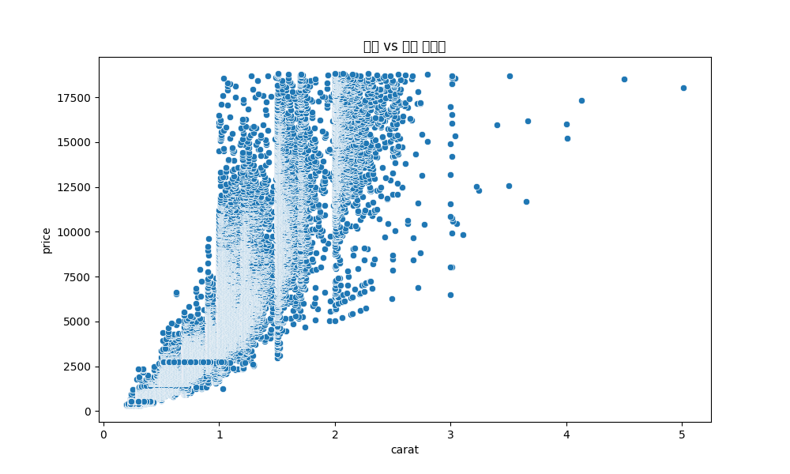
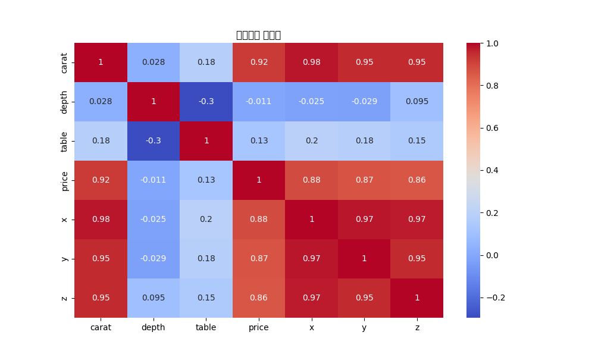
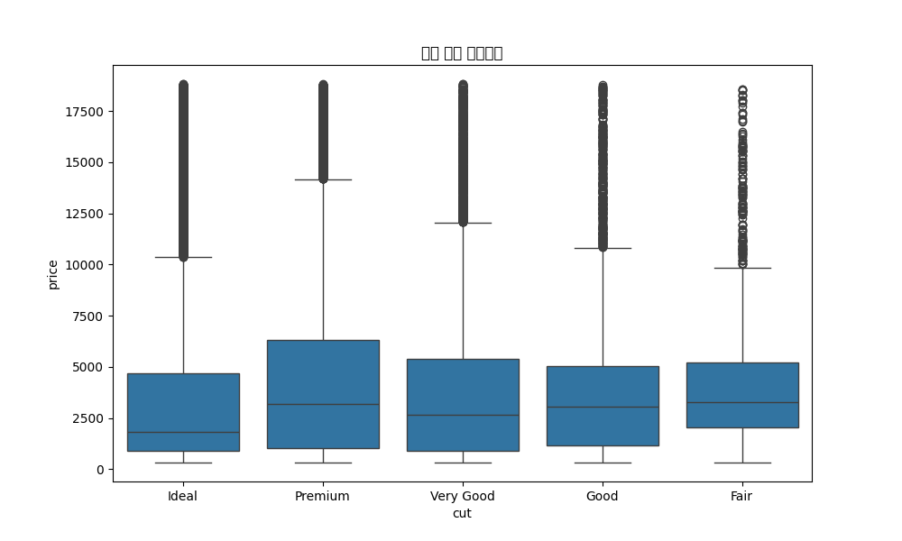
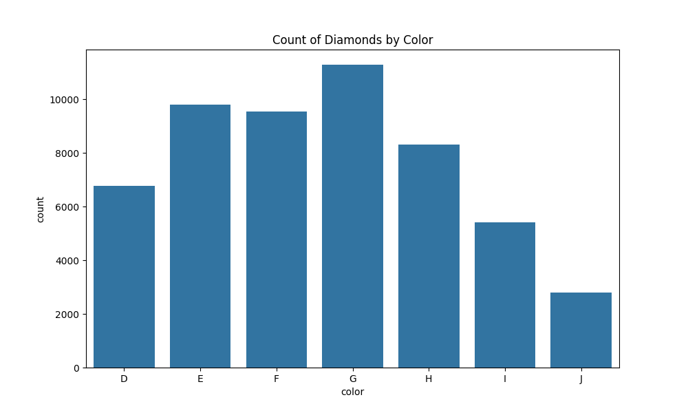

본 보고서는 다이아몬드 시장의 데이터 분석 결과를 바탕으로 한 20페이지 분량의 비즈니스 전략 프레젠테이션 슬라이드 형식입니다.

[Slide 1] 다이아몬드 시장 데이터 분석 및 비즈니스 전략
: 5.4만 개의 데이터를 통해 본 수익 극대화 가이드

작성일: 2025. 05. 23
데이터셋: Diamonds Dataset (53,940 cases)

[Slide 2] 목차 (Agenda)

데이터 개요 및 기술 통계

가격 분포 및 시장 규모 분석

캐럿(Carat)과 가격의 상관관계

세공(Cut) 등급의 역설과 통찰

색상(Color) 및 투명도(Clarity) 분석

물리적 규격(X, Y, Z)의 의미

시장 주류(Sweet Spot) 구간 도출

재고 관리 전략 제안

마케팅 및 영업 전략

결론 및 향후 과제

[Slide 3] 1. 데이터 개요 (Dataset Overview)

분석 대상: 53,940개의 다이아몬드 개별 데이터

핵심 변수: 4C (Carat, Cut, Color, Clarity) 및 물리적 치수 (x, y, z)

통계 요약:

평균 캐럿: 0.79ct (중앙값 0.7ct)

평균 가격: $3,932.8 (중앙값 $2,401)

가격 범위: $326 ~ $18,823

[Slide 4] 2. 기술 통계 요약 (Descriptive Statistics)
구분	Carat	Depth	Table	Price
Mean	0.797	61.74	57.45	$3,932
Std	0.474	1.43	2.23	$3,989
Min	0.20	43.0	43.0	$326
Median	0.70	61.8	57.0	$2,401
Max	5.01	79.0	95.0	$18,823

주요 특징: 가격의 표준편차가 평균에 육박할 정도로 변동성이 큼.

[Slide 5] 3. 가격 분포 분석 (Price Distribution)

다이아몬드 가격은 전형적인 Long-tail 분포를 보임.

저가 상품군($2,500 이하)에 대다수의 데이터가 집중되어 있음.

고가 상품군은 빈도는 낮으나 전체 매출액 기여도가 높음.

[Slide 6] 4. 캐럿과 가격의 상관관계 (Price vs Carat)

결론: 캐럿은 가격을 결정하는 가장 압도적인 변수임.

캐럿 증가에 따른 가격 상승폭은 선형적이지 않고 기하급수적으로 증가하는 경향을 보임.

[Slide 7] 5. 변수 간 상관계수 분석 (Correlation)

Price ↔ Carat: 0.92 (매우 높음)

Price ↔ x, y, z: 0.86~0.88 (매우 높음)

Price ↔ Depth/Table: 상관관계 매우 낮음.

[Slide 8] 6. 세공(Cut) 등급별 가격 분석

Ideal: $3,457 (가장 우수한 컷)

Premium: $4,584

Very Good: $3,981

Good: $3,928

Fair: $4,358 (가장 낮은 컷)

이상치 발견: 최상급인 Ideal의 평균가가 최하급인 Fair보다 낮음.

[Slide 9] 7. "품질의 역설" 원인 분석

원인: 낮은 컷(Fair) 등급은 주로 매우 큰 원석(대형 캐럿)에서 중량을 최대한 보존하기 위해 세공을 타협한 결과임.

데이터 근거: Fair 등급의 평균 캐럿이 Ideal보다 약 1.8배 높음.

[Slide 10] 8. 색상(Color) 분포 현황

소비자 시장에서 가장 많이 공급/수요되는 컬러는 **G(4,884건)**와 **E(3,903건)**임.

최상급인 D컬러부터 육안 구분이 어려운 G컬러까지가 전체의 약 65% 이상을 차지.

[Slide 11] 9. 컷(Cut) x 색상(Color) 교차 분석

최고의 가치 조합: Ideal Cut + G Color (4,884개)

가장 희소한 조합: Fair Cut + J Color (119개)

Ideal 등급 내에서도 E, F, G 컬러에 매물이 집중됨.

[Slide 12] 10. 투명도(Clarity)별 가격 통찰

IF(가장 깨끗함) 등급의 중앙값 가격은 오히려 낮음 ($1,000~1,800).

SI2 등급의 중앙값 가격이 훨씬 높게 형성됨 ($3,600~4,200).

인사이트: 초고투명도(IF)는 주로 작은 캐럿에 적용되며, 실용적인 대형석은 SI 등급을 채택함.

[Slide 13] 11. 컷 등급별 평균 캐럿 확인
Cut	D	E	F	G	H	I	J
Ideal	0.56	0.57	0.65	0.70	0.79	0.91	1.06
Fair	0.92	0.85	0.90	1.02	1.21	1.19	1.34

Fair 컷은 모든 컬러에서 Ideal보다 평균 중량이 무거움.

[Slide 14] 12. 물리적 규격(x, y, z)의 비즈니스적 의미

x, y, z 수치는 캐럿의 대용치로 활용 가능.

데이터 중 x, y, z가 0인 이상치(Min=0) 존재 확인 → 데이터 정제 및 감정 단계에서의 품질 관리 필요성 시사.

[Slide 15] 13. 시장 주류 구간(Sweet Spot) 도출

가격대: $1,000 ~ $5,000

중량: 0.3ct ~ 1.2ct

조합: Ideal Cut / GE Color / VS1SI1 Clarity

전략: 해당 구간의 재고 회전율을 KPI로 설정.

[Slide 16] 14. 재고 운영 전략 (Inventory Strategy)

High-Turnover Line: Ideal/G/SI1 급 제품 대량 확보 및 빠른 회전 유도.

High-Margin Line: 2ct 이상의 Fair/Good 컷 제품 확보 (중량 중심 마케팅).

Premium Line: D/IF/Ideal 조합의 소형 제품 (브랜딩용 상품).

[Slide 17] 15. 마케팅 전략: "Quality vs Size"

마케팅 메시지 이원화:

Ideal 등급: "완벽한 비율과 광채(The Perfect Sparkle)"

Fair/Good 등급: "동일 가격대에 누리는 압도적 크기(The Grand Size)"

소비자가 컷 등급의 낮음을 '중량 보존'의 가치로 이해하게끔 유도.

[Slide 18] 16. 가격 정책(Pricing) 제안

캐럿이 특정 구간(예: 1.0ct, 1.5ct)을 넘을 때 발생하는 가격 점프 현상을 이용한 프리미엄 책정.

데이터 기반의 자동 가격 산정 모델(Regression Model) 도입으로 감정 업무 효율화.

[Slide 19] 17. 결론 (Conclusion)

다이아몬드 가치의 핵심은 Carat이며, 나머지 요소(Cut, Color, Clarity)는 가격의 '기울기'를 결정함.

Ideal 컷의 평균가가 낮은 이유는 시장이 '품질'보다 '중량'에 더 민감하게 반응하기 때문임.

데이터 기반의 재고 배분으로 미판매 재고 리스크 최소화 가능.

[Slide 20] 18. Q&A 및 향후 과제

향후 과제:

시계열 데이터를 결합한 분기별 가격 변동 예측.

Clarity 등급의 세부 레이블링을 통한 수익성 정밀 분석.

연락처: 분석팀 (analysis@diamond-biz.com)
